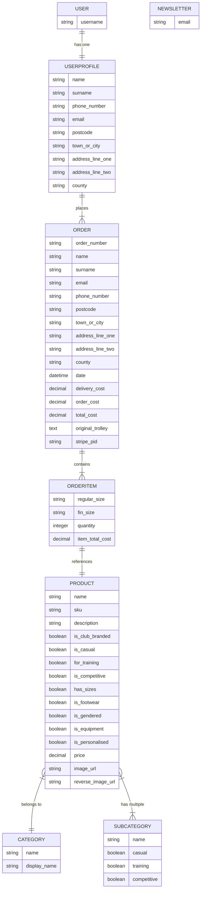

# [milestone-project-4](https://milestone-project-4-sb-1448d349aa27.herokuapp.com)

[](https://www.github.com/seanbrindley17/milestone-project-4/commits/main)
[](https://www.github.com/seanbrindley17/milestone-project-4/commits/main)
[](https://www.github.com/seanbrindley17/milestone-project-4)

⚠️ INSTRUCTIONS ⚠️

In this section, include a few paragraphs providing an overview of your project. Essentially, this part is your "sales pitch". Describe what the project hopes to accomplish, who it is intended to target, and how it will be useful to the target audience.

⚠️ --- END --- ⚠️

🛑 NOTES 🛑

Do not add a **Table of Contents** to your Markdown files. GitHub has these built-in automatically using the headers/hashtags.

Don't add screenshots for the README/TESTING into your `assets` or `static` folders. Create a new folder at the root-level called `documentation`. Consider creating sub-directories within `documentation` to handle things like `wireframes`, `features`, `validation`, `responsiveness`, etc.

**Site Mockups**
*([amiresponsive](https://ui.dev/amiresponsive?url=https://milestone-project-4-sb-1448d349aa27.herokuapp.com), [techsini](https://techsini.com/multi-mockup), etc.)*
Having issues generating site mockups? This is likely due to security policies with your deployed site.
If you open up your DevTools, there may be an error referencing `X-Frame-Options`.

For Chrome users, head over to http://bit.ly/3iRPn4u and install the extension within your browser. Once installed, navigate back to the mockup site of your choice. You should find your site rendering in the various devices now.

Alternatively, open your project in Gitpod and run the server. Once the site is running, click the `Ports` tab from your Gitpod Terminal. Click the padlock on the appropriate port for your project (`Flask: 5000`, `Django: 8000`). This will make your local page public temporarily. Now, copy the URL of your live-preview page into the responsive tool above. You should find your site rendering in the various devices.

🛑 --- END ---- 🛑


source: [milestone-project-4 amiresponsive](https://ui.dev/amiresponsive?url=https://milestone-project-4-sb-1448d349aa27.herokuapp.com)

> [!IMPORTANT]
> The examples in these templates are strongly influenced by the Code Institute walkthrough project called "Boutique Ado".

## UX

### The 5 Planes of UX

#### 1. Strategy Plane
##### Purpose
- Provide a seamless and intuitive e-commerce experience for customers to browse, filter, and purchase products.
- Empower site owners to manage the store's inventory and customer orders efficiently.

##### Primary User Needs
- Guest users need to browse products and checkout with ease.
- Registered customers need a streamlined shopping experience with account and order history features.
- Site owners need robust tools for inventory and order management.

##### Business Goals
- Drive sales by providing a user-friendly shopping experience.
- Build customer loyalty through personalized and efficient account features.
- Maintain an organized and up-to-date store inventory.

#### 2. Scope Plane
##### Features
- A full list of [Features](#features) can be viewed in detail below.

##### Content Requirements
- Product details, including name, price, description, category, and images.
- Clear prompts and instructions for browsing, filtering, and purchasing.
- Order details, confirmation pages, and email notifications.
- Secure payment processing using Stripe.
- Payment success emails sent to users.
- 404 page for lost users.

#### 3. Structure Plane
##### Information Architecture
- **Navigation Menu**:
  - Links to Home, Products, Cart, Newsletter, and Account sections.
- **Hierarchy**:
  - Prominent product categories and filters for easy navigation.
  - Cart and checkout options displayed prominently for convenience.

##### User Flow
1. Guest user browses the store → filters and sorts products by category, price, or name.
2. Guest user adds items to the cart → proceeds to checkout.
3. Guest user creates an account or logs in during checkout → completes purchase.
4. Returning customers log in → view past orders and track purchase history.
5. Site owners manage inventory → add, update, or delete products and categories.
6. Users signup to the newsletter → potentially receive advanced notice of upcoming sales.

#### 4. Skeleton Plane
##### Wireframe Suggestions
- A full list of [Wireframes](#wireframes) can be viewed in detail below.

#### 5. Surface Plane
##### Visual Design Elements
- **[Colours](#colour-scheme)**: see below.
- **[Typography](#typography)**: see below.

### Colour Scheme

I didn't use too much in the way of colour on my site.
The text was left mostly default black, except on links and buttons, where I used the bootstrap text-success, text-danger, text-info classes 

- `#7edeed` The background colour of the header and footer

### Typography

⚠️ INSTRUCTIONS ⚠️

Explain any fonts and icon libraries used, like **Google Fonts**, **Font Awesome**, etc. Consider adding a link to each font used, the Font Awesome site (if used), or similar icon library.

⚠️ --- END --- ⚠️

- [Oxanium](https://fonts.google.com/specimen/Oxanium) was used throughout the site purely because I like it.
- [Font Awesome](https://fontawesome.com) icons were used throughout the site, such as the social media icons in the footer.

## User Stories

| Target | Expectation | Outcome |
| --- | --- | --- |
| As a guest user | I would like to browse products without needing to register | so that I can shop freely before deciding to create an account. |
| As a guest user | I would like to be prompted to create an account or log in at checkout | so that I can complete my purchase and track my order history. |
| As a user | I would like to sign up to the site's newsletter | so that I can stay up to date with any upcoming sales or promotions. |
| As a customer | I would like to browse various product categories | so that I can easily find what I'm looking for. |
| As a customer | I would like to filter products by category | so that I can narrow down the products to the types I am most interested in. |
| As a customer | I would like to click on individual products to view more details (description, price, image, etc.) | so that I can make an informed decision about my purchase. |
| As a customer | I would like to view and manage my shopping cart | so that I can review, add, or remove items before proceeding to checkout. |
| As a customer | I would like to remove items from my cart | so that I can remove products I no longer wish to buy. |
| As a customer | I would like to proceed to checkout where I see my cart items, grand total, and input my name, email, shipping address, and card details | so that I can complete my purchase. |
| As a customer | I would like to receive a confirmation email after my purchase | so that I can have a record of my transaction and order details. |
| As a customer | I would like to see an order confirmation page with a checkout order number after completing my purchase | so that I know my order has been successfully placed. |
| As a customer | I would like to securely enter my card details using Stripe at checkout | so that I can feel confident my payment information is protected. |
| As a returning customer | I would like to be able to log in and view my past orders | so that I can track my previous purchases and order history. |
| As a returning customer | I would like the checkout process to remember my shipping address | so that future purchases are quicker and easier. |
| As a site owner | I would like to create new products with a name, description, price, images, and category | so that I can add additional items to the store inventory. |
| As a site owner | I would like to update product details (name, price, description, image, category) at any time | so that I can keep my product listings accurate and up to date. |
| As a site owner | I would like to delete products that are no longer available or relevant | so that I can maintain a clean and accurate inventory. |
| As a site owner | I would like to manage product categories | so that I can ensure items are correctly organized and easy for customers to find. |
| As a user | I would like to see a 404 error page if I get lost | so that it's obvious that I've stumbled upon a page that doesn't exist. |

## Wireframes

To design the wireframes I used [balsamiq](https://balsamiq.com/wireframes)

| Page | Desktop | Tablet | Mobile |
| :---: | :---: | :---: | :---: |
| Home Page |  |  |  |
| Product Page |  |  |  |
| Product Details Page |  |  |  |
| Trolley Page |  |  |  |

## Features

⚠️ INSTRUCTIONS ⚠️

In this section, you should go over the different parts of your project, and describe each feature. You should explain what value each of the features provides for the user, focusing on your target audience, what they want to achieve, and how your project can help them achieve these things.

**IMPORTANT**: Remember to always include a screenshot of each individual feature!

⚠️ --- END --- ⚠️

### Existing Features

| Feature | Notes | Screenshot |
| --- | --- | --- |
| Register | Authentication is handled by allauth, allowing users to register accounts. |  |
| Login | Authentication is handled by allauth, allowing users to log in to their existing accounts. |  |
| Logout | Authentication is handled by allauth, allowing users to log out of their accounts. |  |
| Product List | Users can browse all available products with sorting, filtering by categories, and search functionality. |  |
| Product Details | Displays detailed information about a selected product, including its name, description, price, an image, and available sizes. |  |
| Add to Bag | Users can add items to their shopping bag, with support for selecting different sizes if applicable. |  |
| View Bag | Users can view the contents of their shopping bag, adjust quantities, or remove items. |  |
| Checkout | Users can proceed to checkout, where they provide their delivery details and payment information using Stripe integration. |  |
| Order Confirmation | Users receive an on-screen and email confirmation with details of their purchase. |  |
| Profile Management | Users can manage their profile information, including their default delivery address and order history. |  |
| Order History | Users can view their past orders and access details of each order, including products purchased and the delivery status. |  |
| Product Management | Superusers can add, edit, and delete products from the site via a CRUD interface. |  |
| Newsletter | Users can register their email address to receive newsletters from the site. Currently, this only stores the email in the database. |  |
| Contact | Users can submit a message via the contact form, which stores their name, email, and message in the database. |  |
| FAQs | Admins can manage frequently asked questions, which are displayed on the site for users. |  |
| User Feedback | Clear and concise Django messages are used to provide feedback to users when interacting with various features (e.g., adding products to the bag, checking out, etc.). |  |
| Heroku Deployment | The site is deployed to Heroku, making it accessible online for users. |  |
| SEO | SEO optimization with a sitemap.xml, robots.txt, and appropriate meta tags to improve search engine visibility. |  |
| Marketing | Social media presence is available in the footer using external links, as well as a Facebook Marketplace wireframe in the README for future integrations. |  |
| 404 | The 404 error page will indicate when a user has navigated to a page that doesn't exist, replacing the default Heroku 404 page with one that ties into the site's look and feel. |  |

### Future Features

- **Product Inventory Alerts**: Notify customers when out-of-stock items are back in stock, or when low inventory is approaching.
- **Multi-Currency and Multi-Language Support**: Expand the application to support multiple currencies and languages to reach a global audience.

## Tools & Technologies

| Tool / Tech | Use |
| --- | --- |
| [](https://markdown.2bn.dev) | Generate README and TESTING templates. |
| [](https://git-scm.com) | Version control. (`git add`, `git commit`, `git push`) |
| [](https://github.com) | Secure online code storage. |
| [](https://code.visualstudio.com) | Local IDE for development. |
| [](https://en.wikipedia.org/wiki/HTML) | Main site content and layout. |
| [](https://en.wikipedia.org/wiki/CSS) | Design and layout. |
| [](https://www.javascript.com) | User interaction on the site. |
| [](https://jquery.com) | User interaction on the site. |
| [](https://www.python.org) | Back-end programming language. |
| [](https://www.heroku.com) | Hosting the deployed back-end site. |
| [](https://getbootstrap.com) | Front-end CSS framework for modern responsiveness and pre-built components. |
| [](https://www.djangoproject.com) | Python framework for the site. |
| [](https://www.postgresql.org) | Relational database management. |
| [](https://stripe.com) | Online secure payments of e-commerce products/services. |
| [](https://mail.google.com) | Sending emails in my application. |
| [](https://aws.amazon.com/s3) | Online static file storage. |
| [](https://balsamiq.com/wireframes) | Creating wireframes. |
| [](https://fontawesome.com) | Icons. |
| [](https://chat.openai.com) | Help debug, troubleshoot, and explain things. |


## Database Design

### Data Model

Here's an ERD for my database.


I have used `Mermaid` to generate an interactive ERD of my project.



source: [Mermaid](https://mermaid.live/edit#pako:eNrNVVFvmzAQ_ivIz2mVNGsS8ra1bKrUrlOSatoUCTlwIdaMTc9225Tw32egdCQmXaW9DCEB93139t195nISyRjIlABeMpogTZfCs9fdPJh9m91-vroOvN3u5GSXe7ezy2DmTb0lyTiNQC1JTa3tbdLVIripiJEUmjKxT63Qir7z7BKXdxeLioywBgTRitygRU2--LgIvtzOflTsFXApEuVp2cnOvfndpz2HDVVearhmGYfGpcyy2Uo744YvxSv1a_B9fh0sFtYhry3lpTQykXiQUsZra1E_Xpd2yYKm4BhjpmxVt-Ef8CVQO42_xVpJyYEKL6LKUO7aNdpmWLcOD5lmoJlmD_urNzV9Zxbql3EzAxUhyzSTwl2XqTDiZhWukIoY4m7CkWzWEsPjGZWOh0m1cdveULFnK7Yu17WU-hEodoIJ2L3ikd3CvWFZCkJ3ohmgkoJyptruMUQspdzLkEVuUS2UQGiQOwjCg40H4QGjaJ9Lt3MS7e5DYdIV4DvbarDT3pJ9y5pt7LE5Fj-TSpd_HAfQ8lGEtqMR01sHpHGMoFTImY1cHso3CfpROoRIGtEOHFNtpZFC9eJ2IgZuVYNbqyGlXbguYTempab8ANPwpK0TS5jtvRWt5BzcLMtHBmHGYreP1U8z71BAYjjFSskOuGbiAGBCQwLo3Rsq9F6hm90zDWl4mELhzoT835TzpkaOyOo_UE6rEB0VMApw7_9dvpAeSQFtRrEdspXPkugNWBYpp0wMa2qHUjllCkulRsv5VkRkqtFAj6A0yab5MFkp1pcx3RgzKn5K-foJMdMSb-qZXo32ikKmOXki08HEPx2Mh5P-0B-NJ_3B-XmPbMn0ZDTunw7PPozO7T0aDPxh0SPPVdSz0-HobDz2h-PJxO_7_qD4Dbafiv0)

⚠️ RECOMMENDED ⚠️

Alternatively, or in addition to, a more comprehensive ERD can be auto-generated once you're at the end of your development stages, just before you submit. Follow the steps below to obtain a thorough ERD that you can include. Feel free to leave the steps below in the README for future use to yourself.

⚠️ --- END --- ⚠️

I have used `pygraphviz` and `django-extensions` to auto-generate an ERD.

The steps taken were as follows:
- In the terminal: `sudo apt update`
- then: `sudo apt-get install python3-dev graphviz libgraphviz-dev pkg-config`
- then type `Y` to proceed
- then: `pip3 install django-extensions pygraphviz`
- in my `settings.py` file, I added the following to my `INSTALLED_APPS`:
```python
INSTALLED_APPS = [
    ...
    'django_extensions',
    ...
]
```
- back in the terminal: `python3 manage.py graph_models -a -o erd.png`
- drag the new `erd.png` file into my `documentation/` folder
- removed `'django_extensions',` from my `INSTALLED_APPS`
- finally, in the terminal: `pip3 uninstall django-extensions pygraphviz -y`


source: [medium.com](https://medium.com/@yathomasi1/1-using-django-extensions-to-visualize-the-database-diagram-in-django-application-c5fa7e710e16)

## Testing

> [!NOTE]
> For all testing, please refer to the [TESTING.md](TESTING.md) file.

## Deployment

The live deployed application can be found deployed on [Heroku](https://milestone-project-4-sb-1448d349aa27.herokuapp.com).

### Heroku Deployment

This project uses [Heroku](https://www.heroku.com), a platform as a service (PaaS) that enables developers to build, run, and operate applications entirely in the cloud.

Deployment steps are as follows, after account setup:

- Select **New** in the top-right corner of your Heroku Dashboard, and select **Create new app** from the dropdown menu.
- Your app name must be unique, and then choose a region closest to you (EU or USA), then finally, click **Create App**.
- From the new app **Settings**, click **Reveal Config Vars**, and set your environment variables to match your private `env.py` file.

> [!IMPORTANT]
> This is a sample only; you would replace the values with your own if cloning/forking my repository.

| Key | Value |
| --- | --- |
| `AWS_ACCESS_KEY_ID` | user-inserts-own-aws-access-key-id |
| `AWS_SECRET_ACCESS_KEY` | user-inserts-own-aws-secret-access-key |
| `DATABASE_URL` | user-inserts-own-postgres-database-url |
| `DISABLE_COLLECTSTATIC` | 1 (*this is temporary, and can be removed for the final deployment*) |
| `EMAIL_HOST_PASS` | user-inserts-own-gmail-api-key |
| `EMAIL_HOST_USER` | user-inserts-own-gmail-email-address |
| `SECRET_KEY` | any-random-secret-key |
| `STRIPE_PUBLIC_KEY` | user-inserts-own-stripe-public-key |
| `STRIPE_SECRET_KEY` | user-inserts-own-stripe-secret-key |
| `STRIPE_WH_SECRET` | user-inserts-own-stripe-webhook-secret |
| `USE_AWS` | True |

Heroku needs some additional files in order to deploy properly.

- [requirements.txt](requirements.txt)
- [Procfile](Procfile)

You can install this project's **[requirements.txt](requirements.txt)** (*where applicable*) using:

- `pip3 install -r requirements.txt`

If you have your own packages that have been installed, then the requirements file needs updated using:

- `pip3 freeze --local > requirements.txt`

The **[Procfile](Procfile)** can be created with the following command:

- `echo web: gunicorn app_name.wsgi > Procfile`
- *replace `app_name` with the name of your primary Django app name; the folder where `settings.py` is located*

For Heroku deployment, follow these steps to connect your own GitHub repository to the newly created app:

Either (*recommended*):

- Select **Automatic Deployment** from the Heroku app.

Or:

- In the Terminal/CLI, connect to Heroku using this command: `heroku login -i`
- Set the remote for Heroku: `heroku git:remote -a app_name` (*replace `app_name` with your app name*)
- After performing the standard Git `add`, `commit`, and `push` to GitHub, you can now type:
	- `git push heroku main`

The project should now be connected and deployed to Heroku!

### PostgreSQL

This project uses a [Code Institute PostgreSQL Database](https://dbs.ci-dbs.net) for the Relational Database with Django.

> [!CAUTION]
> - PostgreSQL databases by Code Institute are only available to CI Students.
> - You must acquire your own PostgreSQL database through some other method if you plan to clone/fork this repository.
> - Code Institute students are allowed a maximum of 8 databases.
> - Databases are subject to deletion after 18 months.

To obtain my own Postgres Database from Code Institute, I followed these steps:

- Submitted my email address to the CI PostgreSQL Database link above.
- An email was sent to me with my new Postgres Database.
- The Database connection string will resemble something like this:
    - `postgres://<db_username>:<db_password>@<db_host_url>/<db_name>`
- You can use the above URL with Django; simply paste it into your `env.py` file and Heroku Config Vars as `DATABASE_URL`.

### Amazon AWS

This project uses [AWS](https://aws.amazon.com) to store media and static files online, due to the fact that Heroku doesn't persist this type of data.

Once you've created an AWS account and logged-in, follow these series of steps to get your project connected. Make sure you're on the **AWS Management Console** page.

#### S3 Bucket

- Search for **S3**.
- Create a new bucket, give it a name (e.g. matching your Heroku app name), and choose the region closest to you.
- Uncheck **Block all public access**, and acknowledge that the bucket will be public (*required* for it to work on Heroku).
- From **Object Ownership**, make sure to have **ACLs enabled**, and **Bucket owner preferred** selected.
- From the **Properties** tab, turn on static website hosting, and type `index.html` and `error.html` in their respective fields, then click **Save**.
- From the **Permissions** tab, paste in the following CORS configuration:

	```shell
	[
		{
			"AllowedHeaders": [
				"Authorization"
			],
			"AllowedMethods": [
				"GET"
			],
			"AllowedOrigins": [
				"*"
			],
			"ExposeHeaders": []
		}
	]
	```

- Copy your **ARN** string.
- From the **Bucket Policy** tab, select the **Policy Generator** link, and use the following steps:
	- Policy Type: **S3 Bucket Policy**
	- Effect: **Allow**
	- Principal: `*`
	- Actions: **GetObject**
	- Amazon Resource Name (ARN): **paste-your-ARN-here**
	- Click **Add Statement**
	- Click **Generate Policy**
	- Copy the entire Policy, and paste it into the **Bucket Policy Editor**

		```shell
		{
			"Id": "Policy1234567890",
			"Version": "2012-10-17",
			"Statement": [
				{
					"Sid": "Stmt1234567890",
					"Action": [
						"s3:GetObject"
					],
					"Effect": "Allow",
					"Resource": "arn:aws:s3:::your-bucket-name/*"
					"Principal": "*",
				}
			]
		}
		```

	- Before you click "Save", add `/*` to the end of the Resource key in the Bucket Policy Editor (*like above*).
	- Click **Save**.
- From the **Access Control List (ACL)** section, click "Edit" and enable **List** for **Everyone (public access)**, and accept the warning box.
	- If the edit button is disabled, you need to change the **Object Ownership** section above to **ACLs enabled** (*mentioned above*).

#### IAM

Back on the AWS Services Menu, search for and open **IAM** (Identity and Access Management). Once on the IAM page, follow these steps:

- From **User Groups**, click **Create New Group**.
	- Suggested Name: `group-milestone-project-4` (*group + the project name*)
- Tags are optional, but you must click it to get to the **review policy** page.
- From **User Groups**, select your newly created group, and go to the **Permissions** tab.
- Open the **Add Permissions** dropdown, and click **Attach Policies**.
- Select the policy, then click **Add Permissions** at the bottom when finished.
- From the **JSON** tab, select the **Import Managed Policy** link.
	- Search for **S3**, select the `AmazonS3FullAccess` policy, and then **Import**.
	- You'll need your ARN from the S3 Bucket copied again, which is pasted into "Resources" key on the Policy.

		```shell
		{
			"Version": "2012-10-17",
			"Statement": [
				{
					"Effect": "Allow",
					"Action": "s3:*",
					"Resource": [
						"arn:aws:s3:::your-bucket-name",
						"arn:aws:s3:::your-bucket-name/*"
					]
				}
			]
		}
		```
	
	- Click **Review Policy**.
	- Suggested Name: `policy-milestone-project-4` (*policy + the project name*)
	- Provide a description:
		- "Access to S3 Bucket for milestone-project-4 static files."
	- Click **Create Policy**.
- From **User Groups**, click your "group-milestone-project-4".
- Click **Attach Policy**.
- Search for the policy you've just created ("policy-milestone-project-4") and select it, then **Attach Policy**.
- From **User Groups**, click **Add User**.
	- Suggested Name: `user-milestone-project-4` (*user + the project name*)
- For "Select AWS Access Type", select **Programmatic Access**.
- Select the group to add your new user to: `group-milestone-project-4`
- Tags are optional, but you must click it to get to the **review user** page.
- Click **Create User** once done.
- You should see a button to **Download .csv**, so click it to save a copy on your system.
	- **IMPORTANT**: once you pass this page, you cannot come back to download it again, so do it immediately!
	- This contains the user's **Access key ID** and **Secret access key**.
	- `AWS_ACCESS_KEY_ID` = **Access key ID**
	- `AWS_SECRET_ACCESS_KEY` = **Secret access key**

#### Final AWS Setup

- If Heroku Config Vars has `DISABLE_COLLECTSTATIC` still, this can be removed now, so that AWS will handle the static files.
- Back within **S3**, create a new folder called: `media`.
- Select any existing media images for your project to prepare them for being uploaded into the new folder.
- Under **Manage Public Permissions**, select **Grant public read access to this object(s)**.
- No further settings are required, so click **Upload**.

### Stripe API

This project uses [Stripe](https://stripe.com) to handle the ecommerce payments.

Once you've created a Stripe account and logged-in, follow these series of steps to get your project connected.

- From your Stripe dashboard, click to expand the "Get your test API keys".
- You'll have two keys here:
	- `STRIPE_PUBLIC_KEY` = Publishable Key (starts with **pk**)
	- `STRIPE_SECRET_KEY` = Secret Key (starts with **sk**)

As a backup, in case users prematurely close the purchase-order page during payment, we can include Stripe Webhooks.

- From your Stripe dashboard, click **Developers**, and select **Webhooks**.
- From there, click **Add Endpoint**.
	- `https://milestone-project-4-sb-1448d349aa27.herokuapp.com/checkout/wh/`
- Click **receive all events**.
- Click **Add Endpoint** to complete the process.
- You'll have a new key here:
	- `STRIPE_WH_SECRET` = Signing Secret (Wehbook) Key (starts with **wh**)

### Gmail API

This project uses [Gmail](https://mail.google.com) to handle sending emails to users for purchase order confirmations.

Once you've created a Gmail (Google) account and logged-in, follow these series of steps to get your project connected.

- Click on the **Account Settings** (cog icon) in the top-right corner of Gmail.
- Click on the **Accounts and Import** tab.
- Within the section called "Change account settings", click on the link for **Other Google Account settings**.
- From this new page, select **Security** on the left.
- Select **2-Step Verification** to turn it on. (*verify your password and account*)
- Once verified, select **Turn On** for 2FA.
- Navigate back to the **Security** page, and you'll see a new option called **App passwords** (*search for it at the top, if not*).
- This might prompt you once again to confirm your password and account.
- Select **Mail** for the app type.
- Select **Other (Custom name)** for the device type.
    - Any custom name, such as "Django" or `milestone-project-4`
- You'll be provided with a 16-character password (API key).
    - Save this somewhere locally, as you cannot access this key again later!
    - If your 16-character password contains *spaces*, make sure to remove them entirely.
    - `EMAIL_HOST_PASS` = user's 16-character API key
    - `EMAIL_HOST_USER` = user's own personal Gmail email address


### Local Development

This project can be cloned or forked in order to make a local copy on your own system.

For either method, you will need to install any applicable packages found within the [requirements.txt](requirements.txt) file.

- `pip3 install -r requirements.txt`.

You will need to create a new file called `env.py` at the root-level, and include the same environment variables listed above from the Heroku deployment steps.

> [!IMPORTANT]
> This is a sample only; you would replace the values with your own if cloning/forking my repository.

Sample `env.py` file:

```python
import os

os.environ.setdefault("AWS_ACCESS_KEY_ID", "user-inserts-own-aws-access-key-id")
os.environ.setdefault("AWS_SECRET_ACCESS_KEY", "user-inserts-own-aws-secret-access-key")
os.environ.setdefault("DATABASE_URL", "user-inserts-own-postgres-database-url")
os.environ.setdefault("EMAIL_HOST_PASS", "user-inserts-own-gmail-host-api-key")
os.environ.setdefault("EMAIL_HOST_USER", "user-inserts-own-gmail-email-address")
os.environ.setdefault("SECRET_KEY", "any-random-secret-key")
os.environ.setdefault("STRIPE_PUBLIC_KEY", "user-inserts-own-stripe-public-key")
os.environ.setdefault("STRIPE_SECRET_KEY", "user-inserts-own-stripe-secret-key")
os.environ.setdefault("STRIPE_WH_SECRET", "user-inserts-own-stripe-webhook-secret")  # only if using Stripe Webhooks

# local environment only (do not include these in production/deployment!)
os.environ.setdefault("DEBUG", "True")
os.environ.setdefault("DEVELOPMENT", "True")
```

Once the project is cloned or forked, in order to run it locally, you'll need to follow these steps:

- Start the Django app: `python3 manage.py runserver`
- Stop the app once it's loaded: `CTRL+C` (*Windows/Linux*) or `⌘+C` (*Mac*)
- Make any necessary migrations: `python3 manage.py makemigrations --dry-run` then `python3 manage.py makemigrations`
- Migrate the data to the database: `python3 manage.py migrate --plan` then `python3 manage.py migrate`
- Create a superuser: `python3 manage.py createsuperuser`
- Load fixtures (*if applicable*): `python3 manage.py loaddata file-name.json` (*repeat for each file*)
- Everything should be ready now, so run the Django app again: `python3 manage.py runserver`

If you'd like to backup your database models, use the following command for each model you'd like to create a fixture for:

- `python3 manage.py dumpdata your-model > your-model.json`
- *repeat this action for each model you wish to backup*
- **NOTE**: You should never make a backup of the default *admin* or *users* data with confidential information.

#### Cloning

You can clone the repository by following these steps:

1. Go to the [GitHub repository](https://www.github.com/seanbrindley17/milestone-project-4).
2. Locate and click on the green "Code" button at the very top, above the commits and files.
3. Select whether you prefer to clone using "HTTPS", "SSH", or "GitHub CLI", and click the "copy" button to copy the URL to your clipboard.
4. Open "Git Bash" or "Terminal".
5. Change the current working directory to the location where you want the cloned directory.
6. In your IDE Terminal, type the following command to clone the repository:
	- `git clone https://www.github.com/seanbrindley17/milestone-project-4.git`
7. Press "Enter" to create your local clone.

Alternatively, if using Gitpod, you can click below to create your own workspace using this repository.

[](https://gitpod.io/#https://www.github.com/seanbrindley17/milestone-project-4)

**Please Note**: in order to directly open the project in Gitpod, you should have the browser extension installed. A tutorial on how to do that can be found [here](https://www.gitpod.io/docs/configure/user-settings/browser-extension).

#### Forking

By forking the GitHub Repository, you make a copy of the original repository on our GitHub account to view and/or make changes without affecting the original owner's repository. You can fork this repository by using the following steps:

1. Log in to GitHub and locate the [GitHub Repository](https://www.github.com/seanbrindley17/milestone-project-4).
2. At the top of the Repository, just below the "Settings" button on the menu, locate and click the "Fork" Button.
3. Once clicked, you should now have a copy of the original repository in your own GitHub account!

### Local VS Deployment

⚠️ INSTRUCTIONS ⚠️

Use this space to discuss any differences between the local version you've developed, and the live deployment site. Generally, there shouldn't be [m]any major differences, so if you honestly cannot find any differences, feel free to use the following example:

⚠️ --- END --- ⚠️

There are no remaining major differences between the local version when compared to the deployed version online.

## Credits

### Content

| Source | Notes |
| --- | --- |
| [Markdown Builder](https://markdown.2bn.dev) | Help generating Markdown files |
| [Boutique Ado](https://codeinstitute.net) | Code Institute walkthrough project inspiration. A lot of the code used in this project was repurposed from this project, due to being our only reference point for Django as a first time user. |
| [Bootstrap](https://getbootstrap.com) | Various components / responsive front-end framework |
| [AWS S3](https://aws.amazon.com/s3) | Cloud storage for static/media files |
| [Stripe](https://docs.stripe.com/payments/elements) | Online payment services |
| [Gmail API](https://developers.google.com/gmail/api/guides) | Sending payment confirmation emails |
| [W3Schools](https://www.w3schools.com/) | General help with code, how to use certain elements etc |
| [ChatGPT](https://chatgpt.com) | Help with code logic and explanations, particularly for integration of AWS and migration to PostGre |

### Media

⚠️ INSTRUCTIONS ⚠️

Use this space to provide attribution links to any media files borrowed from elsewhere (images, videos, audio, etc.). If you're the owner (or a close acquaintance) of some/all media files, then make sure to specify this information. Let the assessors know that you have explicit rights to use the media files within your project. Ideally, you should provide an actual link to every media file used, not just a generic link to the main site, unless it's AI-generated artwork.

Looking for some media files? Here are some popular sites to use. The list of examples below is by no means exhaustive. Within the Code Institute Slack community, you can find more "free media" links by sending yourself (or Slackbot) the following command: `!freemedia`.

- Images
    - [Pexels](https://www.pexels.com)
    - [Unsplash](https://unsplash.com)
    - [Pixabay](https://pixabay.com)
    - [Lorem Picsum](https://picsum.photos) (placeholder images)
    - [Wallhere](https://wallhere.com) (wallpaper / backgrounds)
    - [This Person Does Not Exist](https://thispersondoesnotexist.com) (reload to get a new person)
- Audio
    - [Audio Micro](https://www.audiomicro.com/free-sound-effects)
- Video
    - [Videvo](https://www.videvo.net)
- Image Compression
    - [TinyPNG](https://tinypng.com) (for images <5MB)
    - [CompressPNG](https://compresspng.com) (for images >5MB)

A few examples have been provided below to give you some ideas on how to do your own Media credits.

⚠️ --- END ---⚠️

The images of the product I used for my store are all owned by me, they're my own kit from the swimming club. This makes it easier as I only have to credit myself.

| Source | Notes |
| --- | --- |
| [favicon.io](https://favicon.io) | Generating the favicon |
| [Font Awesome](https://fontawesome.com) | Icons used throughout the site |
| [Pexels](https://www.pexels.com/photo/underwater-photography-of-swimmer-711187/) | Hero image |

### Acknowledgements (Throughout the course)

- I would like to thank my Code Institute mentor, [Chris Quinn](https://www.github.com/10xOXR) for the support throughout the development of this project and projects 1 & 2. In addition, I'd like to thank Jubril Akolade for stepping in to mentor me for milestone project 3.
- I would like to thank the [Code Institute](https://codeinstitute.net) Tutor Team for their assistance with troubleshooting and debugging some project issues.
- I'd like to thank the chaps in the discord, even though I was never particularly active in it. Good luck in the rest of your careers.
- I would like to thank my family, particularly my parents, for believing in me and putting up with their 30 year old son living at home to allow me to study and attempt to make the tranfer into this new industry.

